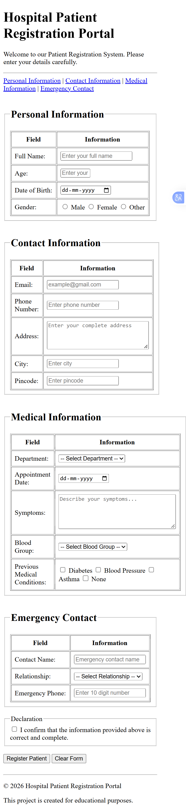

# 🏥 Hospital Patient Registration Portal

A simple **Hospital Patient Registration Portal** developed using **HTML5**.

---

## 📌 Project Description

This project is a web-based patient registration form created to practice and demonstrate important HTML concepts.

---

## ✨ Features

- Personal Information Form
- Contact Information
- Medical Information
- Emergency Contact Details
- Gender Selection
- Blood Group Selection
- Previous Medical Conditions
- Form Validation
- Patient Registration and Reset Buttons

---

## 🛠️ Technologies Used

- HTML5

---

## 📚 HTML Concepts Covered

- HTML Document Structure
- Semantic HTML
- Forms
- Tables
- Input Fields
- Radio Buttons
- Checkboxes
- Dropdown Lists
- Textarea
- Fieldset and Legend
- Labels
- Navigation Links
- Form Validation
- Header, Main, Section and Footer

---

## 📂 Project Structure

```text
Hospital-Patient-Registration-Portal/
│
├── index.html
├── README.md
└── screenshots/
    └── hospital-patient-registration.png
```

---

## 📸 Project Screenshot



---

## ▶️ How to Run

1. Download or clone this repository.
2. Open the project folder.
3. Open `index.html` in any web browser.

No backend server or database is required.

---

## 🎯 Purpose

This project was developed as part of Java Full Stack internship training to strengthen HTML fundamentals and practical web development skills.

---

## 👨‍💻 Author

**Yogendra Kumar**